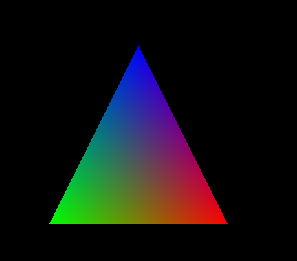
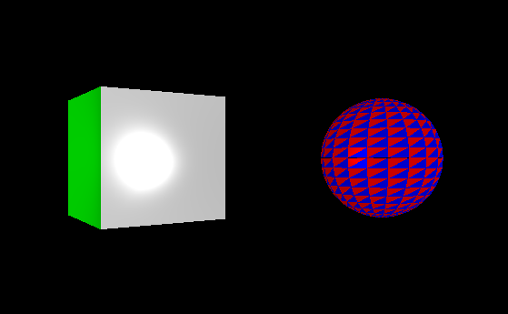
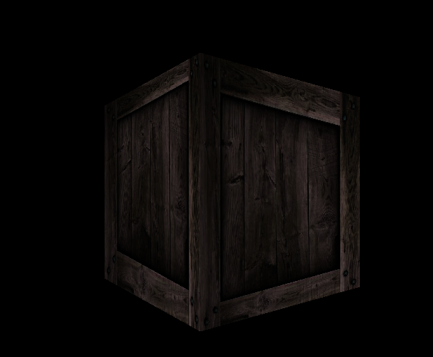
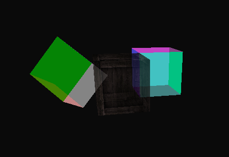
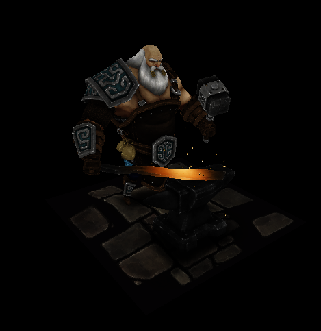

# **Rasterizer**

## Commande de lancement

```sh
make -j && ./Rasterizer 
```

## *Mappage des touche global* :

**W** : Se deplacer vers l'avant.

**S** : Se deplacer vers l'arriere.

**D** : Se deplacer vers la droite.

**A** : Se deplacer vers la gauche.

**Espace** : Se deplacer vers le haut.

**Shift gauche** : Se deplacer vers le bas.

**Deplacement de la souris** : Regarder autour de soi.

**F1** : Basculer en mode wireframe/Revenir en mode normal

-----

## **Scene 1**

Affiche un triangle coloré en utilisant les coordonnées baricentrique.


 
-----

## **Scene 2**

Affiche quelque polygone eclairé par une lumiere modifiable.



-----

## **Scene 3**

Affiche un cube texturé.
(La correction de la texture par interpolation m'a pas pus etre implémentée)



-----

## **Scene 4**

Affiche plusieurs cube dont la transparence est modifiable.



-----

## **Scene 5**

Affiche plusieurs polygones plus complexe texturé pour afficher un personnage.


